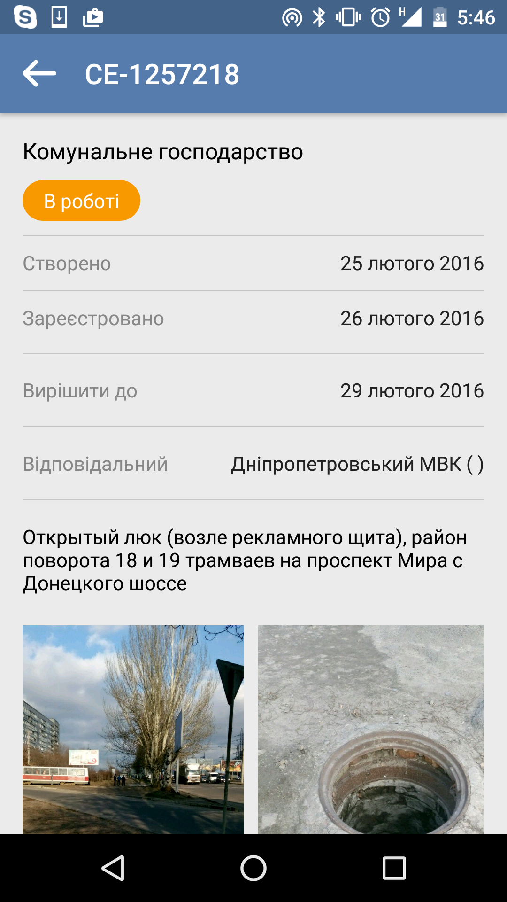
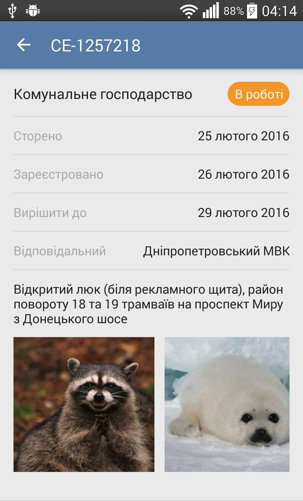
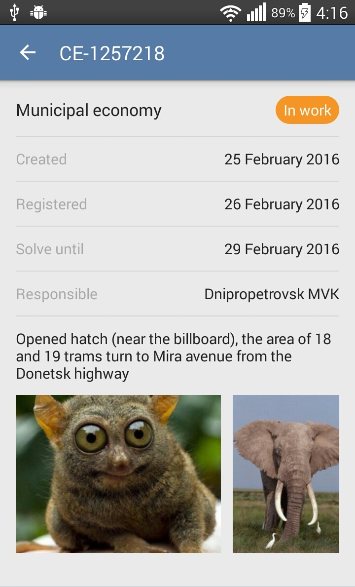

# Yalantis Internship. Task 1

Create screen with controls

It should be screen with ScrollView, textviews and  horizontal recycler view with images

**Requirments:** 
- Put dimens and text sizes into res folder
- Minimal SDK version = 16
- Only portrait orientation
- For image loading use one of third party libraries 
- Support different screen sizes  (from mdpi, only phones)
- Use styles 
- Back button should close application
- Ukrainian and English localization should be included.  
- When user presses any control, show toast with control name
- Project should be pushed into github.com / bitbucket
- Use [google code style](https://source.android.com/source/code-style.html)  
- Also you should find UI mistakes, suggest how to solve it

Good luck!
___________________________________________________________
**My result**

 

**Possible UI mistakes:**
- using two languages(Russian and Ukrainian) at the same time;
- the arrow of back button is too big
- different distance between dividers and their thickness
- wrong place for status (orange TextView)
