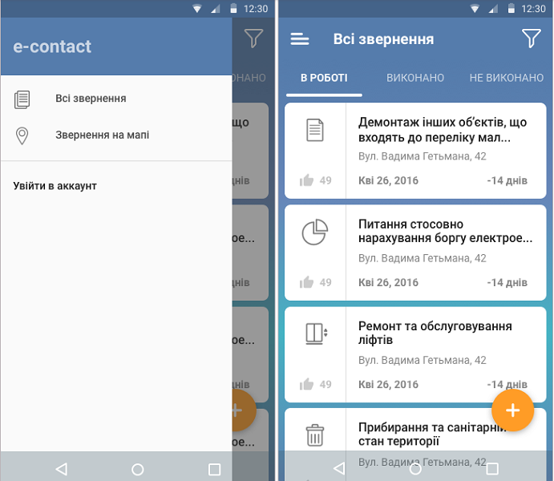
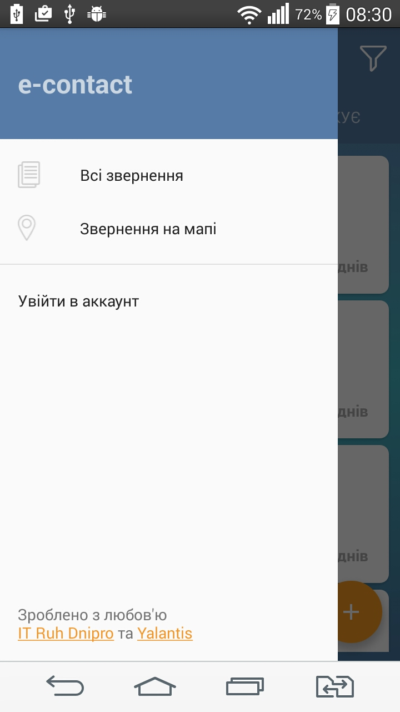
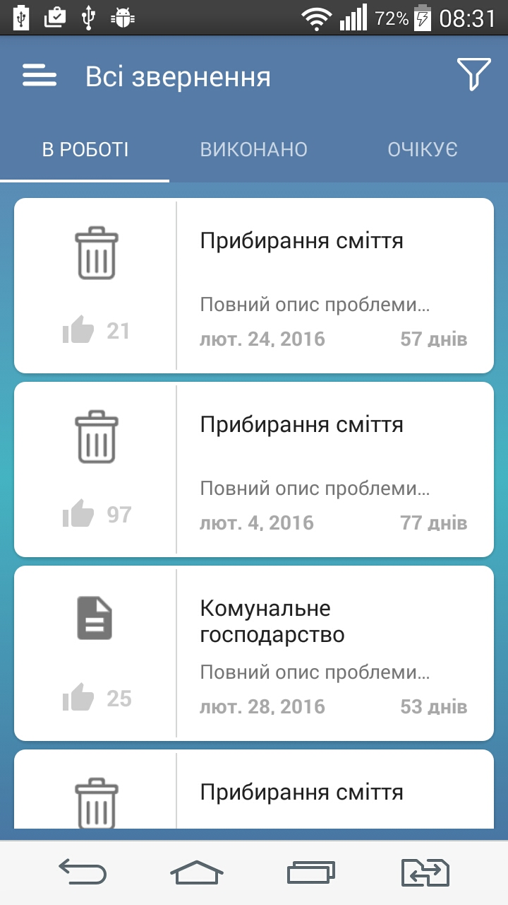

# Android Intership Task2

Create screen with controls

It should be 3 tabs and Navigation drawer with test data (10 items). 

**Requirments:** 
- Put dimens and text sizes into res folder. 
- Use google code style !!!!!
- For first and second tab use recyclerview 
- On list item click, open first task screen
- For third tab use listview 
- When user scrolls list, floating action button should hide with animation 
- Use styles 
- Minimal SDK version = 16
- Only portrait orientation

Please don’t commit .idea directory. Use master branch as default. 
Projects that does not use at least one of requirments listed above, will not be checked.

Good luck!)
_________________________________________________________________
**My result**

 

_________________________________________________________________
_________________________________________________________________

# Yalantis Internship. Task 1

Create screen with controls

It should be screen with ScrollView, textviews and  horizontal recycler view with images

**Requirments:** 
- Put dimens and text sizes into res folder
- Minimal SDK version = 16
- Only portrait orientation
- For image loading use one of third party libraries 
- Support different screen sizes  (from mdpi, only phones)
- Use styles 
- Back button should close application
- Ukrainian and English localization should be included.  
- When user presses any control, show toast with control name
- Project should be pushed into github.com / bitbucket
- Use [google code style](https://source.android.com/source/code-style.html)  
- Also you should find UI mistakes, suggest how to solve it

Good luck!
___________________________________________________________
**My result**

 

**Possible UI mistakes:**
- using two languages(Russian and Ukrainian) at the same time;
- the arrow of back button is too big
- different distance between dividers and their thickness
- wrong place for status (orange TextView)
